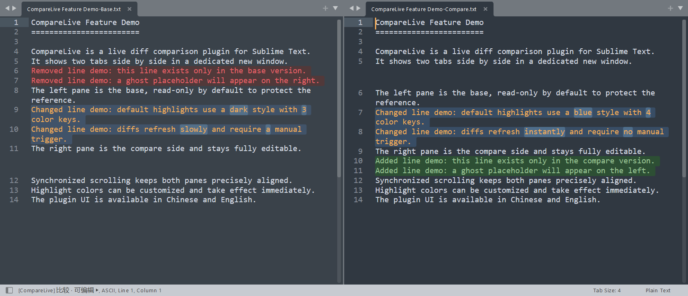

# CompareLive

English | [简体中文](README_zh.md)

> A live diff comparison plugin for Sublime Text: side-by-side two-pane comparison in a dedicated new window, with diffs refreshed in real time as you edit; two-layer line + word-level character highlighting, synchronized scrolling, ghost placeholder lines for visual alignment, and fully configurable highlight colors.


---

## 📸 Interface preview



---

## ✨ Features

- **Live diff comparison** — Two panes side by side; edits in the right pane recompute and refresh diff highlights in real time
- **Two-layer intraline highlighting** — Changed lines use a "light full-line background + bold word-level character color" design, so diff hotspots stand out at a glance
- **Synchronized scrolling** — Both panes scroll together based on a line mapping table, staying precisely aligned even across diff regions
- **Ghost placeholder lines** — When one side has lines the other lacks, equal-height blank Phantom blocks are inserted to keep both sides visually aligned
- **Multilingual UI** — Chinese (`zh_CN`) and English (`en`); menus, command palette entries, and status bar text are regenerated automatically on switch
- **Configurable highlight colors** — Added/removed/changed/character background colors and foreground color are all customizable and take effect immediately
- **Dedicated compare window** — Comparison runs in a new window with sidebar and minimap hidden, leaving your original workspace untouched
- **Read-only base pane** — The left base pane is read-only by default (configurable), protecting the reference content from accidental edits

## 📦 Installation

### Via Package Control (recommended)

1. Press `Ctrl+Shift+P` (macOS: `Cmd+Shift+P`) to open the Command Palette
2. Type `Package Control: Install Package` and press Enter
3. Search for `CompareLive` and install

### Manual Installation

1. In Sublime Text, open `Preferences -> Browse Packages...` to locate the Packages directory
2. Clone or extract this repository into that directory as a folder named `CompareLive`:

```bash
cd <Packages directory>
git clone https://github.com/<your-name>/CompareLive.git CompareLive
```

3. Restart Sublime Text; the plugin loads automatically

> The plugin takes effect automatically once loaded — highlight colors and UI language adapt to your current environment.

## 🚀 Usage

### Option 1: Command Palette

Press `Ctrl+Shift+P` and type:

| Command | Description |
| --- | --- |
| `CompareLive: Compare with Selected Tab` | Opens a quick panel listing other open tabs; pick one as the **base (left)** while the current tab becomes the **compare (right)** side |
| `CompareLive: End Compare` | Ends the current session, closes the compare window, and returns to the original window |
| `Preferences: CompareLive Settings` | Opens the plugin settings file for customization |

### Option 2: Menu Bar

- `Preferences -> Package Settings -> CompareLive -> Settings / End Current Compare`

### Option 3: Context Menus

- **Right-click in the editor area**: `CompareLive -> Compare with Selected Tab / End Compare`
- **Right-click on a tab**: click the `CompareLive` menu item to start a comparison

### Workflow

1. In the original window, activate (or right-click) the tab you want as the **compare side**
2. Run "Compare with Selected Tab" and pick another tab in the quick panel as the **base side**
3. The plugin opens a dedicated two-column window: **base (read-only) on the left**, **compare (editable) on the right**, with focus placed on the right pane
4. Edit freely on the right — highlights refresh live; scroll either pane and the other follows automatically
5. When done, run "End Compare" (or simply close the compare window) to return to the original window; unsaved changes are handled by Sublime Text's native save prompt

> At least two open tabs are required for the compare menu items to appear/be enabled.

## ⚙️ Configuration

Open `CompareLive.sublime-settings` via `Preferences -> Package Settings -> CompareLive -> Settings`. **Changes take effect immediately** (no restart needed).

### Settings Overview

| Setting | Type | Default | Description |
| --- | --- | --- | --- |
| `language` | string | `"zh_CN"` | UI language, supports `"zh_CN"` (Chinese) / `"en"` (English); invalid values fall back to `zh_CN` |
| `base_readonly` | boolean | `true` | Whether the base (left) pane is read-only; invalid values fall back to `true` |
| `colors` | object | see below | Custom highlight colors; supports `#RGB` / `#RRGGBB` / `#RRGGBBAA` or CSS color syntax |

### colors Keys

Default colors follow the IntelliJ IDEA Darcula diff style:

| Key | Default | Description |
| --- | --- | --- |
| `added_bg` | `#2d4f34` | Added line background (right pane, dark green) |
| `removed_bg` | `#4b2e2e` | Removed line background (left pane, dark red) |
| `changed_bg` | `#384d65` | Changed line full-line background (both panes, medium blue) |
| `changed_char_bg` | `#4e6d8b` | Changed character background within a line (both panes, bright blue, the visual focus) |
| `foreground` | `""` | Foreground color of highlighted regions; empty = inherit the editor default |

### Full Configuration Example

```jsonc
{
    // UI language: "zh_CN" = Chinese, "en" = English
    "language": "en",

    // Whether the base (left) pane is read-only
    "base_readonly": true,

    // Custom highlight colors, applied immediately on change
    "colors": {
        "added_bg": "#2d4f34",
        "removed_bg": "#4b2e2e",
        "changed_bg": "#384d65",
        "changed_char_bg": "#4e6d8b",
        "foreground": ""
    }
}
```

> Invalid settings never break the plugin: a validation notice is printed to the console and the value falls back to its default.

## 📁 Project Structure

```
CompareLive/
├── compare_live.py              # Main plugin file: session management & UI control logic
├── diff_engine.py               # Diff engine: line-level & character-level diff detection
├── color_scheme.py              # Dynamic color scheme generator
├── CompareLive.sublime-settings # Plugin settings file
├── Default.sublime-commands     # Command palette definitions (auto-generated per language)
├── Main.sublime-menu            # Main menu: Preferences entry (auto-generated)
├── Context.sublime-menu         # Editor context menu (auto-generated)
├── Tab Context.sublime-menu     # Tab context menu (auto-generated)
├── *.sublime-color-scheme       # Highlight overlay named after the active color scheme (auto-generated)
├── LICENSE                      # MIT License
└── README.md                    # Project readme
```

> The `*.sublime-menu` files and `Default.sublime-commands` are regenerated automatically on plugin load according to the `language` setting; the `*.sublime-color-scheme` file is an overlay auto-generated from the highlight color settings and the currently active color scheme (cleaned up on uninstall). Do not edit these files by hand.

## 📄 License

This project is released under the [MIT License](LICENSE). Copyright (c) 2026 Mwei.
