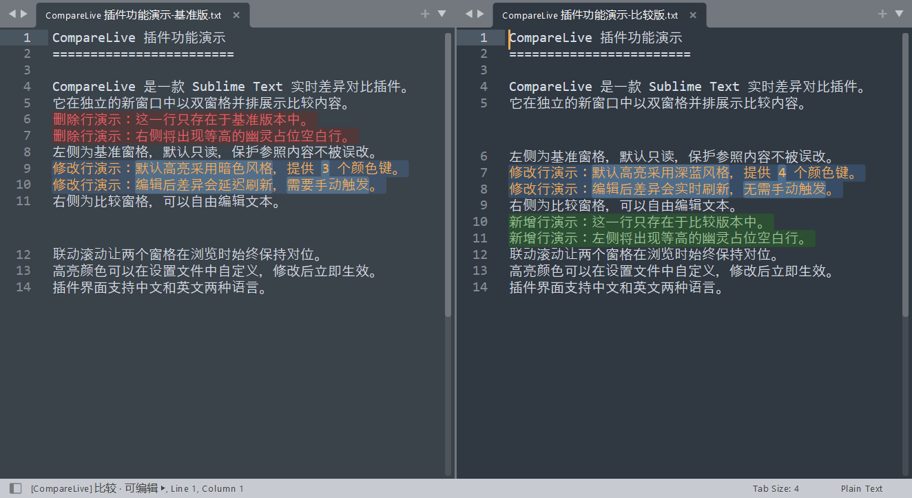

# CompareLive

[English](README_en.md) | 简体中文

> Sublime Text 实时差异对比插件：在独立新窗口中双窗格并排比较，编辑时实时刷新差异；行级 + 词级字符两层高亮，联动滚动，幽灵占位行视觉对齐，高亮颜色可配置。


---

## 📸 界面预览


---

## ✨ 功能特性

- **实时差异对比** — 双窗格并排显示，右侧编辑时实时重算并刷新差异高亮
- **行内字符级两层高亮** — 修改行采用"整行淡底色 + 词级字符重色"双层设计，差异焦点一目了然
- **联动滚动** — 左右窗格基于行映射表同步滚动，差异区段也能精准对位
- **幽灵占位行** — 当一侧有行而另一侧没有时，自动插入等高空白 Phantom 占位块，保持两侧视觉对齐
- **多语言界面** — 支持中文（`zh_CN`）与英文（`en`），切换后菜单、命令面板、状态栏文案自动重新生成
- **高亮颜色可配置** — 新增/删除/修改/字符四类背景色及前景色均可自定义，修改后立即生效
- **独立比较窗口** — 比较在新窗口中进行，自动隐藏侧边栏与迷你地图，不干扰原工作区
- **基准侧只读保护** — 左侧基准默认只读（可通过配置关闭），防止误改参照内容

## 📦 安装

### 通过 Package Control（推荐）

1. 按 `Ctrl+Shift+P`（macOS：`Cmd+Shift+P`）打开命令面板
2. 输入 `Package Control: Install Package` 并回车
3. 搜索 `CompareLive` 并安装

### 手动安装

1. 打开 Sublime Text，菜单选择 `Preferences -> Browse Packages...` 打开 Packages 目录
2. 将本仓库克隆或解压到该目录下，文件夹命名为 `CompareLive`：

```bash
cd <Packages 目录>
git clone https://github.com/<your-name>/CompareLive.git CompareLive
```

3. 重启 Sublime Text，插件自动加载

> 插件加载后即自动生效，高亮配色与界面语言会自动适配当前环境。

## 🚀 使用方法

### 方式一：命令面板

按 `Ctrl+Shift+P` 打开命令面板，输入：

| 命令 | 说明 |
| --- | --- |
| `CompareLive: 与选定标签比较` | 弹出快速面板列出其它已打开标签，选择一个作为**基准（左侧）**，当前标签作为**比较（右侧）** |
| `CompareLive: 结束比较` | 结束当前比较会话，关闭比较窗口并回到原窗口 |
| `Preferences: CompareLive 设置` | 打开插件设置文件进行自定义 |

### 方式二：菜单栏

- `Preferences -> Package Settings -> CompareLive -> Settings / 结束当前比较`

### 方式三：右键菜单

- **编辑区右键**：`CompareLive -> 与选定标签比较 / 结束比较`
- **标签页右键**：直接点击 `CompareLive` 菜单项发起比较

### 操作流程

1. 在原窗口中激活（或右键点击）想要作为**比较侧**的标签
2. 执行"与选定标签比较"命令，在弹出的快速面板中选择另一个标签作为**基准侧**
3. 插件自动打开一个独立的两列布局新窗口：**左侧为基准（只读）**，**右侧为比较（可编辑）**，焦点自动落在右侧
4. 在右侧自由编辑，差异高亮实时刷新；滚动任意一侧，另一侧自动同步
5. 比较结束后执行"结束比较"命令（或直接关闭比较窗口），自动回到原窗口；未保存的更改由 Sublime Text 原生保存提示接管

> 至少需要打开两个标签，比较相关菜单项才会出现/可用。

## ⚙️ 配置说明

通过 `Preferences -> Package Settings -> CompareLive -> Settings` 打开 `CompareLive.sublime-settings` 进行配置，**修改后自动生效**（无需重启）。

### 配置项一览

| 配置项 | 类型 | 默认值 | 说明 |
| --- | --- | --- | --- |
| `language` | string | `"zh_CN"` | 界面语言，支持 `"zh_CN"`（中文）/ `"en"`（英文），非法值回退 `zh_CN` |
| `base_readonly` | boolean | `true` | 基准（左）窗格是否只读，非法值回退 `true` |
| `colors` | object | 见下表 | 自定义高亮配色，支持 `#RGB` / `#RRGGBB` / `#RRGGBBAA` 或 CSS 颜色写法 |

### colors 子项

默认配色参考 IntelliJ IDEA Darcula 差异对比风格：

| 键 | 默认值 | 说明 |
| --- | --- | --- |
| `added_bg` | `#2d4f34` | 新增行背景（右侧，暗绿） |
| `removed_bg` | `#4b2e2e` | 删除行背景（左侧，暗红） |
| `changed_bg` | `#384d65` | 修改行整行背景（两侧，中等蓝） |
| `changed_char_bg` | `#4e6d8b` | 修改行内字符背景（两侧，亮蓝，视觉焦点） |
| `foreground` | `""` | 高亮区域前景色，留空沿用编辑器默认前景色 |

### 完整配置示例

```jsonc
{
    // 界面语言："zh_CN" = 中文, "en" = English
    "language": "zh_CN",

    // 基准(左)窗格是否只读
    "base_readonly": true,

    // 自定义高亮配色，修改后自动生效
    "colors": {
        "added_bg": "#2d4f34",
        "removed_bg": "#4b2e2e",
        "changed_bg": "#384d65",
        "changed_char_bg": "#4e6d8b",
        "foreground": ""
    }
}
```

> 非法配置值不会导致插件报错：插件会在控制台打印校验提示并自动回退到默认值。

## 📁 项目结构

```
CompareLive/
├── compare_live.py              # 主插件文件：会话管理与 UI 控制逻辑
├── diff_engine.py               # 差异计算引擎：行级与字符级差异检测
├── color_scheme.py              # 动态颜色方案生成器
├── CompareLive.sublime-settings # 插件配置文件
├── Default.sublime-commands     # 命令面板命令定义（按语言自动生成）
├── Main.sublime-menu            # 主菜单：Preferences 入口（自动生成）
├── Context.sublime-menu         # 编辑区右键菜单（自动生成）
├── Tab Context.sublime-menu     # 标签页右键菜单（自动生成）
├── *.sublime-color-scheme       # 高亮配色 overlay，与当前激活配色方案同名（自动生成）
├── LICENSE                      # MIT 许可证
└── README.md                    # 项目说明
```

> `*.sublime-menu` 与 `Default.sublime-commands` 由插件根据 `language` 配置在加载时自动重新生成；`*.sublime-color-scheme` 为插件根据高亮颜色设置与当前激活的配色方案自动生成的 overlay 文件（卸载时自动清理）。以上文件请勿手动编辑。

## 📄 许可证

本项目基于 [MIT License](LICENSE) 开源。Copyright (c) 2026 Mwei。
